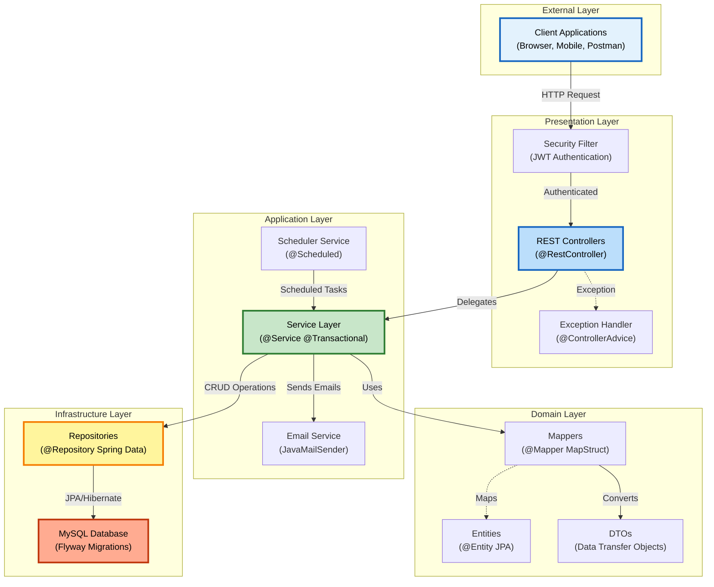
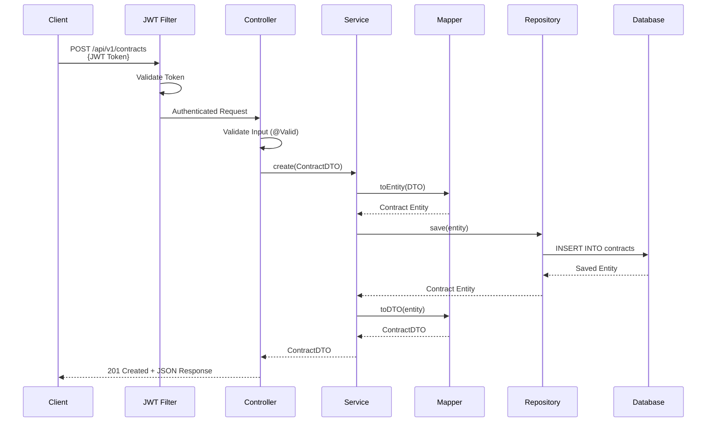

# 🏢 BCM v2.0 - Business Contracts Manager

> SaaS platform for contract lifecycle management built with Spring Boot 3.5.10 and Java 21

[](https://github.com/DonatoCorbacioDev/bcm-v2-backend/actions/workflows/ci.yml)
[](https://openjdk.org/)
[](https://spring.io/projects/spring-boot)
[](./target/site/jacoco/index.html)
[](./target/site/jacoco/index.html)
[](./LICENSE)
[](https://www.mysql.com/)
[](https://flywaydb.org/)

## 🎯 Overview

BCM v2.0 is the second iteration of my Business Contract Manager system, representing a complete architectural redesign from the original version developed during my master's thesis. This version showcases modern Spring Boot best practices, high test coverage (99% instruction, 96% branch, 99% line — see [Code Quality Metrics](#-code-quality-metrics)), JWT-based security hardening, and automated database versioning with Flyway. It is a portfolio/MVP project moving toward production readiness — see [Roadmap](#-roadmap) and [docs/SECURITY.md](./docs/SECURITY.md) for what's done and what's still open. High coverage means the test suite exercises most branches, not that every test asserts meaningful business behavior — the cross-tenant isolation and auth tests are the ones worth reading first.

**Project Type:** Portfolio Project | Full-Stack SaaS Backend  
**Status:** Active Development  
**Author:** Donato Corbacio  
**Contact:** donatocorbacio92@gmail.com

> This repository is published as a portfolio/demonstration project for code review and learning purposes. The author retains all commercial rights, including the possibility of a future SaaS launch — see [LICENSE](./LICENSE).

This is the API for the [bcm-v2-frontend](https://github.com/DonatoCorbacioDev/bcm-v2-frontend) dashboard — see that repo's [Screenshots](https://github.com/DonatoCorbacioDev/bcm-v2-frontend#-screenshots) section for what the UI looks like.

---

## ✨ Key Features

### Contract Management

- Full CRUD operations for contract lifecycle
- Advanced search and filtering with pagination
- Multi-manager assignment per contract
- Contract status tracking (ACTIVE, EXPIRED, CANCELLED, etc.)
- Audit trail with complete history

### Security & Authentication

- JWT-based stateless authentication
- BCrypt password hashing
- Role-based access control (ADMIN, MANAGER)
- Email verification system
- Password reset functionality
- Invite-only user registration

### Business Logic

- Role-specific contract visibility (Admins see all, Managers see assigned)
- Collaborative contract management
- Financial values tracking per contract
- Business area organization
- Real-time dashboard KPIs

### Database Management

- Automated, versioned schema migrations with Flyway (31 migrations applied in sequence)
- Forward-only by design — no automatic rollback; reverting a bad migration means writing and shipping a new corrective migration, not undoing the old one
- Multi-environment consistency (dev/test/prod)

---

## 🏗️ Architecture

### System Overview



### Layered Architecture

```
┌─────────────────────────────────────────┐
│       Controllers (REST API)            │  HTTP Layer
├─────────────────────────────────────────┤
│          Services                       │  Business Logic
├─────────────────────────────────────────┤
│    Mappers (DTO ↔ Entity)              │  Data Transformation
├─────────────────────────────────────────┤
│    Repositories (Spring Data)           │  Data Access
├─────────────────────────────────────────┤
│         Entities (JPA)                  │  Domain Models
└─────────────────────────────────────────┘
```

A standard Spring layered architecture, not Clean/Hexagonal Architecture in the strict sense — entities are JPA-annotated and services depend directly on Spring Data repositories, so the domain layer is not framework-independent. That's a reasonable, common trade-off for this kind of CRUD-heavy business app, just worth naming accurately.

**Key Principles:**
- **Separation of Concerns:** Each layer has a single responsibility
- **Testability:** Each layer can be tested independently (services are unit-tested against mocked repositories; controllers against a mocked service layer)
- **Maintainability:** Changes to persistence details (e.g. a new column) are localized to entity/mapper/migration, not scattered across controllers

### Architecture Decisions

The non-obvious calls — why a monolith except for ML, why shared-schema multi-tenancy, why a
local LLM instead of a cloud API, why MySQL + in-memory search instead of a vector database —
are written up with alternatives and trade-offs in [docs/adr/](./docs/adr/README.md).

### Request Flow Example



### Technology Stack

**Backend Framework:**

- Spring Boot 3.5.10
- Java 21 LTS
- Maven for dependency management

**Database:**

- MySQL 8.0
- Spring Data JPA / Hibernate
- HikariCP connection pooling
- Flyway for database migrations and version control

**Caching / Rate Limiting:**

- Redis 7 — backs the distributed login/register rate limiter (`bucket4j-redis` + Lettuce). Required to start the app in `dev`/`prod` (same tier as MySQL); the `test` profile uses an in-memory limiter instead, so the fast unit suite needs no Redis.

**Security:**

- Spring Security 6
- JWT (JJWT 0.12.6)
- BCrypt password encoder
- OAuth2 Client (prepared for future integrations)

**Testing:**

- JUnit 5 (Jupiter)
- Mockito for mocking
- Spring Boot Test + MockMvc
- H2 in-memory database for the fast unit suite (`mvn test`, no Docker needed)
- Testcontainers + real MySQL 8.0 for integration tests (`*IT.java`, run via `mvn verify`) — real Flyway migrations, real schema constraints, real cross-tenant query behavior; see [Testing](#-testing)

**Code Quality & Analysis:**

- JaCoCo (75% minimum threshold enforced on every build; current run ~99%)
- SpotBugs for bug detection
- FindSecBugs for security analysis
- SonarQube compatible

**API Documentation:**

- SpringDoc OpenAPI 3.0
- Swagger UI integration

**Additional Libraries:**

- MapStruct for DTO mapping
- Lombok for boilerplate reduction
- Hibernate Validator

---

## 📊 Code Quality Metrics

| Metric                    | Value                          | Status              |
| ------------------------- | ------------------------------- | ------------------- |
| **Instruction Coverage**  | 99% (17,241 / 17,415)          | ✅ High             |
| **Branch Coverage**       | 96% (1,090 / 1,135)            | ✅ High             |
| **Line Coverage**         | 99% (3,908 / 3,941)            | ✅ High             |
| **Test Classes**          | 98 classes                     | ✅ Comprehensive    |
| **Test Methods**          | ~1,234 methods                 | ✅ Extensive        |
| **Security Scan**         | No issues                      | ✅ FindSecBugs pass |
| **Package Coverage**      | 122 classes total, `service` package trails the rest at 98%/96% | ✅ High |

Numbers above are from the last local `mvn clean test jacoco:report` run (2026-07-22); regenerate with the same command to verify — see [target/site/jacoco/index.html](./target/site/jacoco/index.html). High coverage is a signal that the suite exercises the code, not proof the assertions are meaningful — see the note in [Overview](#-overview).

---

## 🗂️ Project Structure

```
src/main/java/com/donatodev/bcm_backend/
├── auth/              # Authentication controllers and services
├── config/            # Application configuration (CORS, etc.)
├── controller/        # REST API controllers
├── dto/               # Data Transfer Objects
├── entity/            # JPA entities (domain models)
├── exception/         # Custom exceptions + GlobalExceptionHandler
├── jwt/               # JWT utilities and filters
├── mapper/            # DTO ↔ Entity mappers (MapStruct)
├── repository/        # Spring Data JPA repositories
├── security/          # Security configuration
├── service/           # Business logic layer
└── util/              # Utility classes

src/test/java/         # Mirror structure with comprehensive tests
src/main/resources/
├── application.properties           # Main configuration
├── application-dev.properties       # Development profile
├── application-prod.properties      # Production profile
└── db/migration/                    # Flyway migration scripts (V1–V31, see below)

sql/                   # Legacy SQL files (reference only, deprecated)
```

---

## 🗄️ Database Migrations (Flyway)

This project uses **Flyway** for automatic database version control and migrations, ensuring consistent schemas across all environments.

### Migration Files

Located in `src/main/resources/db/migration/` — 31 migrations (V1–V31), 26 tables total:

| File                                        | Description                                              |
| -------------------------------------------- | --------------------------------------------------------- |
| **V1\_\_initial_schema.sql**                 | Creates the initial schema (12 tables)                    |
| **V2\_\_seed_reference_data.sql**            | Inserts system roles, business areas, financial types     |
| **V3\_\_add_performance_indexes.sql**        | Adds performance indexes for optimized queries            |
| **V4\_\_create_admin_user.sql**              | Seeds the default admin account                            |
| **V5\_\_add_created_at_to_users.sql**        | Adds `created_at` to `users`                               |
| **V6\_\_rename_admin_username.sql**          | Normalizes the default admin's username                    |
| **V7\_\_create_organizations.sql**           | Adds `organizations` (multi-tenancy foundation)             |
| **V8\_\_add_organization_id.sql**            | Scopes existing tables to `organization_id`                 |
| **V9\_\_create_refresh_tokens.sql**          | Adds `refresh_tokens` for JWT refresh flow                  |
| **V10\_\_create_audit_logs.sql**             | Adds `audit_logs`                                           |
| **V11\_\_create_contract_documents.sql**     | Adds `contract_documents` (PDF uploads)                     |
| **V12\_\_rename_s3_key_to_storage_path.sql** | Renames `s3_key` → `storage_path` (post-AWS removal)         |
| **V13\_\_create_notifications.sql**          | Adds `notifications`                                        |
| **V14\_\_neutralize_default_admin.sql**      | Disables the V4 default admin account's known password hash |
| **V15\_\_create_electronic_invoices.sql**    | Adds `electronic_invoices` (FatturaPA)                       |
| **V16\_\_ml_result_cache.sql**               | Adds `ml_result_cache`                                       |
| **V17\_\_hash_refresh_tokens.sql**           | Migrates refresh tokens to SHA-256 hashed storage             |
| **V18\_\_create_contract_templates.sql**     | Adds `contract_templates`                                    |
| **V19\_\_translate_reference_data_to_italian.sql** | Translates seeded business areas/financial types to Italian |
| **V20\_\_create_risk_feedback.sql**          | Adds `risk_feedback` (user feedback loop on ML risk scores)   |
| **V21\_\_add_organization_bank_details.sql** | Adds `iban`/`bic` to `organizations`                          |
| **V22\_\_add_invoice_payment_details.sql**   | Adds supplier IBAN/BIC to `electronic_invoices`               |
| **V23\_\_create_sepa_payment_batches.sql**   | Adds `sepa_payment_batches` (pain.001 SEPA payments)           |
| **V24\_\_add_user_calendar_token.sql**       | Adds `calendar_token` to `users` (ICS calendar export)         |
| **V25\_\_add_totp_two_factor_auth.sql**      | Adds TOTP secret/enabled columns to `users` (2FA)              |
| **V26\_\_add_contract_workflow.sql**         | Adds `workflow_stage` to `contracts` (approval workflow)       |
| **V27\_\_widen_contract_status_enum_for_draft.sql** | Widens the native `contracts.status` ENUM to include `DRAFT` |
| **V28\_\_backfill_orphaned_draft_workflow_stage.sql** | Data-fix migration for a workflow-stage backfill bug     |
| **V29\_\_add_document_embedding.sql**        | Adds `embedding` to `contract_documents` (semantic search)     |
| **V30\_\_add_budgets_and_financial_type_category.sql** | Adds `budgets` and REVENUE/COST category on financial types |
| **V31\_\_add_document_versioning.sql**       | Adds document version grouping + cached extracted text (redlining) |

### How It Works

1. **First Startup:** Flyway detects an empty database and executes all migrations sequentially
2. **Version Tracking:** Creates `flyway_schema_history` table to track applied migrations
3. **Subsequent Startups:** Only runs new migrations (version > current)
4. **Automatic Execution:** Migrations run automatically on `mvn spring-boot:run`

### Benefits

- ✅ **Zero manual SQL execution** - Fully automated
- ✅ **Environment consistency** - Same schema in dev/test/prod
- ✅ **Team collaboration** - Everyone shares the same DB version
- ⚠️ **No automatic rollback** - Flyway (open-source edition) only moves forward; undoing a bad migration means writing a new corrective one, not reverting the old

### Flyway Commands

```bash
# View migration status
mvn flyway:info

# Manually trigger migrations (rarely needed)
mvn flyway:migrate

# Validate checksums
mvn flyway:validate

# Repair migration history (if needed)
mvn flyway:repair

# Clean database (⚠️ DANGER: deletes all data!)
mvn flyway:clean
```

### Adding New Migrations

When you need to modify the database:

1. Create new file with incremented version: `V32__your_description.sql` (check the highest existing version first)
2. Write your SQL DDL/DML changes
3. Restart application → Flyway detects and applies automatically
4. Commit migration file to Git

**Example:**

```sql
-- V32__add_example_table.sql
CREATE TABLE example_table (
    id BIGINT AUTO_INCREMENT PRIMARY KEY,
    contract_id BIGINT NOT NULL,
    note VARCHAR(255) NOT NULL,
    created_at TIMESTAMP DEFAULT CURRENT_TIMESTAMP,
    FOREIGN KEY (contract_id) REFERENCES contracts(id) ON DELETE CASCADE
);
```

---

## 🛠️ Setup Instructions

### Prerequisites

- **Java 21** or higher
- **MySQL 8.0+** (or compatible)
- **Redis 7+** — required to run the `dev`/`prod` profiles (rate limiting); not needed to run `mvn test`
- **Maven 3.8+**
- **Git**

### 1. Clone Repository

```bash
git clone https://github.com/DonatoCorbacioDev/bcm-v2-backend.git
cd bcm-v2-backend
```

### 2. Database Setup

**✅ With Flyway (Recommended - Fully Automated):**

```bash
# Login to MySQL
mysql -u root -p

# Create empty database
CREATE DATABASE bcm CHARACTER SET utf8mb4 COLLATE utf8mb4_unicode_ci;

# Exit MySQL
exit

# Flyway will automatically create tables and seed data on first startup!
```

**That's it!** On application startup, Flyway will:

- ✅ Create the full schema (26 tables across 31 migrations)
- ✅ Insert system roles (ADMIN, MANAGER)
- ✅ Add business areas and financial types
- ✅ Create performance indexes

**📜 Manual Setup (Legacy - Not Recommended):**

Only use if you want to bypass Flyway:

```bash
# Create database and run schema manually
mysql -u root -p bcm < sql/DDL/bcm_schema.sql

# (Optional) Load additional sample data
mysql -u root -p bcm < sql/DML/bmc_data.sql
```

⚠️ **Note:** The `sql/` folder contains legacy scripts for reference only. In production, **always use Flyway**.

### 3. Environment Configuration

Create a `.env` file in the project root (see `.env.example` for template):

```bash
# Database
DB_URL=jdbc:mysql://localhost:3306/bcm
DB_USERNAME=your_username
DB_PASSWORD=your_password

# JWT
JWT_SECRET=your-base64-encoded-secret-key-minimum-256-bits
JWT_EXPIRATION_MS=86400000

# Email (Gmail example)
MAIL_HOST=smtp.gmail.com
MAIL_PORT=587
MAIL_USERNAME=your-email@gmail.com
MAIL_PASSWORD=your-gmail-app-password
MAIL_SMTP_AUTH=true
MAIL_SMTP_STARTTLS=true

# Frontend URL (for CORS)
FRONTEND_BASE_URL=http://localhost:3000
```

**Note:** For Gmail, use an [App Password](https://support.google.com/accounts/answer/185833), not your regular password.

### Ollama setup (for semantic document search)

Unlike the other AI features (proxied through [bcm-v2-ml](https://github.com/DonatoCorbacioDev/bcm-v2-ml)), this backend calls Ollama directly via Spring AI to embed contract documents for search:

```bash
ollama pull nomic-embed-text
ollama serve
```

### 4. Build and Run

```bash
# Install dependencies and build
mvn clean install

# Run in development mode (Flyway will auto-migrate)
mvn spring-boot:run

# Or specify profile explicitly
mvn spring-boot:run -Dspring-boot.run.profiles=dev
```

**Expected Output:**

```
[INFO] Flyway: Migrating schema `bcm` to version "1 - initial schema"
[INFO] Flyway: Migrating schema `bcm` to version "2 - seed reference data"
...
[INFO] Flyway: Migrating schema `bcm` to version "31 - add document versioning"
[INFO] Flyway: Successfully applied 31 migrations to schema `bcm`, now at version v31
[INFO] Started BcmBackendApplication in 7.873 seconds
```

The application will start at: `http://localhost:8090/api/v1`

### 5. Access API Documentation

Once running, visit:

- **Swagger UI:** http://localhost:8090/api/v1/swagger-ui.html
- **OpenAPI JSON:** http://localhost:8090/api/v1/api-docs
- **Health Check:** http://localhost:8090/api/v1/actuator/health
- **Prometheus Metrics:** http://localhost:8090/api/v1/actuator/prometheus — standard JVM/HTTP metrics plus custom ones: `bcm_ml_call_seconds` (ML proxy call latency, tagged `endpoint`/`outcome`), `bcm_ml_cache_result_total` (cache hit/miss, tagged `outcome`), `bcm_embedding_generate_seconds` (Ollama embedding latency, tagged `outcome`)

---

## 🧪 Testing

### Run Tests

```bash
# Run the fast unit suite (H2, no Docker needed) — this is what CI/PRs gate on
mvn test

# Run tests with coverage report
mvn clean test jacoco:report

# View coverage report
open target/site/jacoco/index.html

# Run specific test class
mvn test -Dtest=ContractServiceTest

# Run tests for specific package
mvn test -Dtest="com.donatodev.bcm_backend.service.*Test"

# Skip tests during build
mvn clean package -DskipTests

# Run integration tests too (*IT.java) — real MySQL 8.0 via Testcontainers,
# requires a running Docker daemon. Not part of `mvn test`; separate on
# purpose because spinning up a container per class is much slower than the
# H2 suite. See "Integration Tests" below for what these actually check.
mvn verify
```

### Integration Tests

Three classes so far, under `src/test/java/.../integration/`:

- **`FlywayMigrationIT`** — boots the full Spring context against real MySQL with `spring.flyway.enabled=true` and `spring.jpa.hibernate.ddl-auto=validate`. If any migration fails, or a JPA entity no longer matches the real schema, this test fails at context startup — something the H2 unit suite structurally can't catch (H2's "MySQL mode" is an approximation, not real MySQL; V27 exists specifically because a native `ENUM` mismatch slipped past it once). Extends `AbstractMySQLIntegrationTest` (a shared, single Testcontainers MySQL instance, reused across classes in the same run).
- **`CrossTenantIsolationIT`** — seeds two organizations with their own contracts and business areas, then asserts `ContractsRepository.findByIdAndOrganization_Id`/`findByOrganization_Id` never return another tenant's row. The service-layer guard that calls these methods (`ContractAccessGuard`) is unit-tested against a mocked repository elsewhere; this is what actually proves the isolation holds against a real query plan and real foreign keys. Also extends `AbstractMySQLIntegrationTest`.
- **`RateLimitingRedisIT`** — proves the Redis-backed rate limiter actually coordinates across backend instances against a real Redis (Testcontainers `redis:7-alpine`), not just a mocked proxy manager: two independent `RedisRateLimitBucketSource` instances sharing one Redis correctly see the same bucket. No Spring context needed for this one (no MySQL container either), just the class under test wired directly to a real Lettuce connection.

### Test Coverage by Package

| Package    | Instruction / Branch | Key Tests                        |
| ---------- | --------------------- | -------------------------------- |
| service    | 98% / 96%              | Business logic (all services)    |
| controller | 100% / 100%            | REST endpoints (all controllers) |
| mapper     | 100% / 100%            | All DTO mappings                 |
| auth       | 100% / 100%            | AuthService, AuthController      |
| jwt        | 100% / 100%            | Token generation/validation      |
| exception  | 100% / n/a             | Global exception handling        |
| aspect     | 99% / 96%              | Audit aspect                     |
| security   | 100% / n/a             | SecurityConfig                   |
| util       | 100% / 100%            | Utility classes                  |

`service` is the largest package by far (2,875 of 3,941 total lines) and trails slightly on branch coverage — mostly best-effort error-handling branches (e.g. OCR/embedding failures that degrade gracefully rather than fail the request) that are harder to trigger deterministically in a unit test. DTOs, entities, config, and the main application class are excluded from measurement (see [CLAUDE.md](./CLAUDE.md)).

**Note:** Tests use H2 in-memory database with Flyway disabled for speed.

---

## 📚 API Endpoints

Non-exhaustive — covers the core resources below. There are 8 controllers total, including several not listed here (documents, budgets, financial types, contract templates, SEPA payments, electronic invoices, semantic search, audit logs). For the complete, always-current list, see Swagger UI or the OpenAPI JSON at runtime (links in [Setup Instructions](#5-access-api-documentation)).

### Authentication

```
POST   /api/v1/auth/login              # User login
POST   /api/v1/auth/forgot-password    # Request password reset
POST   /api/v1/auth/reset-password     # Reset password with token
```

### Contracts

```
GET    /api/v1/contracts               # List all contracts (ADMIN)
GET    /api/v1/contracts/{id}          # Get contract by ID
GET    /api/v1/contracts/search        # Search with pagination & filters
POST   /api/v1/contracts               # Create new contract (ADMIN)
PUT    /api/v1/contracts/{id}          # Update contract (ADMIN)
DELETE /api/v1/contracts/{id}          # Delete contract (ADMIN)
GET    /api/v1/contracts/stats         # Dashboard statistics
PATCH  /api/v1/contracts/{id}/assign-manager  # Assign manager
GET    /api/v1/contracts/{id}/collaborators   # Get collaborators
PATCH  /api/v1/contracts/{id}/collaborators   # Set collaborators
```

### Users

```
GET    /api/v1/users                   # List users
GET    /api/v1/users/{id}              # Get user by ID
POST   /api/v1/users/invite            # Invite new user (ADMIN)
POST   /api/v1/users/complete-invite   # Complete registration
PATCH  /api/v1/users/{id}/assign-manager  # Assign manager to user
```

### Managers

```
GET    /api/v1/managers                # List all managers
GET    /api/v1/managers/{id}           # Get manager by ID
POST   /api/v1/managers                # Create manager
PUT    /api/v1/managers/{id}           # Update manager
DELETE /api/v1/managers/{id}           # Delete manager
```

### Other Endpoints

```
GET    /api/v1/roles                   # List roles
GET    /api/v1/business-areas          # List business areas
GET    /api/v1/financial-types         # List financial types
GET    /api/v1/financial-values        # Financial values CRUD
```

**Authentication:** Most endpoints require JWT token in `Authorization: Bearer <token>` header.

---

## 🔒 Security Features

### Implemented Security Measures

- ✅ Stateless JWT authentication
- ✅ BCrypt password hashing (strength: 12 rounds)
- ✅ CORS configuration (programmatic)
- ✅ SQL injection protection (JPA parameterized queries)
- ✅ XSS protection headers
- ✅ CSRF disabled (API-only, stateless)
- ✅ Role-based authorization with `@PreAuthorize`
- ✅ Email verification required before login
- ✅ Password reset with expiring tokens
- ✅ Sensitive endpoints restricted by role
- ✅ No passwords in logs or responses
- ✅ Environment variables for secrets (`.env` git-ignored)

### Security Scanning

```bash
# Run SpotBugs security analysis
mvn spotbugs:check

# View security report
open target/spotbugs.xml

# Generate a CycloneDX SBOM (also runs automatically on `mvn package`)
mvn package -DskipTests
open target/classes/META-INF/sbom/application.cdx.json
```

- **SBOM (Software Bill of Materials):** every `mvn package` generates a CycloneDX SBOM listing all ~180 direct + transitive dependencies with resolvable package URLs — the input a vulnerability scanner (Grype, Trivy, Dependency-Track) or an auditor needs, not itself a scanner. Uploaded as a CI artifact on every build (`.github/workflows/ci.yml`); available at runtime via `/actuator/sbom` (authenticated — deliberately not on the `prod` profile's exposed endpoint list, since it's a ready-made list of exact dependency versions to check against known CVEs).
- **Dependabot:** weekly automated PRs for outdated/vulnerable Maven dependencies and GitHub Actions (`.github/dependabot.yml`) — this is what would have caught the Next.js DoS/SSRF/cache-poisoning CVEs patched on 2026-07-22 automatically, instead of a manual `npm audit` pass.

---

## 🚀 Deployment

### Environment Profiles

The application supports multiple profiles:

- **dev** (default): Development mode with debug logging, Flyway baseline-on-migrate
- **test**: Testing environment with H2 database, Flyway disabled
- **prod**: Production mode with optimized settings, Flyway validate-on-migrate

## 🗺 Roadmap

- **MVP (done):** core contract/document/invoice lifecycle, JWT auth with refresh-token rotation and reuse detection, multi-tenancy, RBAC, audit log, notifications, ML proxy (forecast/risk score), FatturaPA XML viewer.
- **Beta (in progress):** cross-tenant regression test coverage, production security checklist (see [docs/SECURITY.md](./docs/SECURITY.md)), secret scanning in CI, accessibility pass on the frontend.
- **Production readiness (open):** credential rotation runbook, dataset-backed ML baselines beyond the current rule-based/linear models.

### Production Deployment Checklist

Before deploying to production:

- [ ] Generate strong JWT secret (minimum 256 bits, Base64-encoded)
- [ ] Use production database with SSL/TLS
- [ ] Configure `application-prod.properties` with production values
- [ ] Verify Flyway migrations are tested
- [ ] Enable HTTPS only
- [ ] Set up automated database backups
- [ ] Configure monitoring (Actuator + external service)
- [ ] Review and restrict CORS origins
- [ ] Set up log aggregation
- [ ] Enable rate limiting (external solution)
- [ ] Perform security audit
- [ ] Set up CI/CD pipeline

### Example Production Run

```bash
# Build production artifact
mvn clean package -Pprod

# Run with production profile
java -jar target/bcm-backend-1.0.0-SNAPSHOT.jar --spring.profiles.active=prod

# Or with Docker (already available — see the bcm-v2-docker repo for the full
# multi-service compose; this is just the backend image standalone)
docker build -t bcm-backend:1.0.0 .
docker run -p 8090:8090 --env-file .env.prod bcm-backend:1.0.0
```

---

## 📝 Version History

### Version 2.0 (2025) — Initial Rewrite

- ✨ Migrated to Spring Boot 3.5.10 + Java 21
- ✨ Redesigned architecture with layered Spring services
- ✨ JWT-based authentication
- ✨ Role-based access control, email verification, multi-manager support
- ✨ Flyway database migrations, multi-environment configuration (dev/test/prod)
- ✨ OpenAPI 3 documentation

### Since then (2025–2026) — Ongoing Development

The rewrite above was the starting point, not the finish line. Since then: multi-tenancy with organization-scoped data isolation, refresh-token rotation with reuse detection, TOTP 2FA, an approval workflow for contracts, FatturaPA (Italian e-invoicing) parsing, SEPA pain.001 payment batches, document OCR + AI-assisted clause risk analysis, semantic document search (Spring AI + Ollama embeddings), an ML microservice for forecasting/anomaly detection/risk scoring (see [bcm-v2-ml](https://github.com/DonatoCorbacioDev/bcm-v2-ml)), budget tracking per business area, and document version history with a redline diff view. Several rounds of security hardening (SpotBugs/FindSecBugs, cross-tenant regression tests, secret scanning) happened alongside, not as an afterthought — see [docs/SECURITY.md](./docs/SECURITY.md) for what's production-ready vs. still open.

### Version 1.0 (2024)

**Original Implementation:**

- Initial version developed during master's thesis
- Angular + Spring Boot + MySQL stack
- Basic CRUD functionality
- Single-manager assignment
- Simple authentication
- Manual SQL script execution

---

## 🐛 Known Limitations & Future Improvements

### Current Limitations

- Notifications are in-app/polling only, no WebSocket push
- No Kubernetes deployment manifests (Docker Compose only, in the `bcm-v2-docker` repo)
- ML risk classifier is trained on synthetic labels derived from the same rule-based formula it complements, not on real contract outcomes — see [MODEL_CARD.md](https://github.com/DonatoCorbacioDev/bcm-v2-ml/blob/main/MODEL_CARD.md) in the `bcm-v2-ml` repo

### Planned Improvements

- [ ] WebSocket real-time notifications
- [ ] Kubernetes deployment manifests
- [ ] ML risk classifier trained on real contract outcomes once enough labeled data exists
- [ ] Performance optimization for large datasets

---

## 👨‍💻 About the Developer

**Donato Corbacio**

- 🎓 Bachelor's Degree in Computer Science and Software Production Technologies (Dec 2024)
- 💼 Full-Stack Developer seeking opportunities
- 📚 Currently studying: Python IFTS & AI Automation Business
- 🌍 Based in Puglia, Italy
- 💡 Passionate about clean code, modern architecture, and continuous learning

### Contact & Links

- 📧 Email: donatocorbacio92@gmail.com
- 💼 LinkedIn: [linkedin.com/in/donato-corbacio](https://www.linkedin.com/in/donato-corbacio/)
- 🐱 GitHub: [@DonatoCorbacioDev](https://github.com/DonatoCorbacioDev)
- 🌐 Portfolio: [Coming Soon]

---

## 📄 License

This project is licensed under a **Custom Non-Commercial License** - see the [LICENSE](./LICENSE) file for full details.

> **This project itself is NOT open source.** It is published as a personal portfolio project under a custom restrictive license. See [LICENSE](./LICENSE) for details.

**Summary:**

- ✅ Code available for educational purposes and review
- ✅ May be used for learning and portfolio demonstration
- ❌ Commercial use prohibited without explicit permission
- ❌ Cannot be sold or offered as SaaS without authorization

For commercial licensing inquiries: donatocorbacio92@gmail.com

---

## ⚠️ Disclaimer

This is a **portfolio/demonstration project** showcasing modern Spring Boot development practices.

**Important Notes:**

- This repository contains NO sensitive data (all dummy/example data)
- Configuration uses environment variables (`.env` file git-ignored)
- Not intended for production use without proper security audit
- Sample data is for testing purposes only
- Legacy SQL files in `sql/` folder are for reference only (use Flyway migrations)

**Before production deployment:**

- Perform comprehensive security review
- Conduct penetration testing
- Review data protection compliance (GDPR, etc.)
- Set up proper monitoring and alerting
- Implement rate limiting and DDoS protection
- Verify all Flyway migrations are tested

---

## 🙏 Acknowledgments

Built with modern technologies and best practices from:

- Spring Framework ecosystem
- Java and JVM community
- Flyway database migration tool
- Open-source contributors worldwide

Special thanks to the developers of all libraries and tools used in this project.

---

## 🔗 Related Projects

BCM v2.0 is split across 4 repositories:

- **[bcm-v2-frontend](https://github.com/DonatoCorbacioDev/bcm-v2-frontend)** — Next.js/TypeScript dashboard
- **[bcm-v2-ml](https://github.com/DonatoCorbacioDev/bcm-v2-ml)** — FastAPI service for risk scoring, forecasting, anomaly detection and LLM-based clause analysis
- **[bcm-v2-docker](https://github.com/DonatoCorbacioDev/bcm-v2-docker)** — Docker Compose setup to run the full stack with one command
- **BCM v1.0** (Thesis Project): Angular-based original version

---

**⭐ If you're a recruiter or technical reviewer**, feel free to explore the codebase. For questions or to discuss this project in detail, please reach out via email or LinkedIn.

**💬 Open to feedback and collaboration opportunities!**
