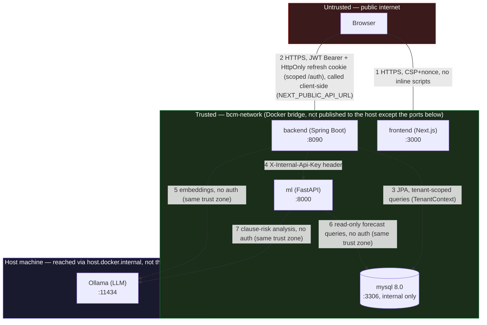

# Security overview

This document summarizes the current threat model and the concrete steps required before
running BCM in production. It reflects the state of the codebase as audited on 2026-07-16,
not aspirational claims — update it whenever a control changes.

For personal-data-specific obligations (GDPR: data categories, sub-processors,
retention, data-subject rights), see `docs/GDPR.md` — this document covers
the technical security controls that back article 32.

## Threat model

### Trust boundaries

**Where the real boundary crossings are, and what's missing:**

1. **Browser → Frontend**: the only crossing with no authentication by design (login page must be reachable). CSP with a per-request nonce is the main control (`middleware.ts`).
2. **Browser → Backend**: every state-changing or data-reading request crosses this boundary directly — the frontend is a single-page app that calls the backend API client-side (`NEXT_PUBLIC_API_URL`), not through a server-side proxy that could otherwise sit in front of it as a second choke point. JWT Bearer token + `HttpOnly`/`Secure`/`SameSite=Lax` refresh cookie scoped to `/auth` are the controls; see the table below for what's not yet covered (distributed rate limiting).
3. **Backend → MySQL**: *not* a zero-trust boundary today — no network-level auth beyond the DB password, and the database has no idea what tenant a query is scoped to. All isolation is enforced in application code (`TenantContext` + explicit `findByOrganization_Id`-style queries), verified by `CrossTenantIsolationIT` against a real database. If that discipline ever lapses on a single query, MySQL itself won't stop it — this is the single most consequential trust assumption in the whole system.
4. **Backend → ML**: the one internal hop that *does* carry its own credential (`X-Internal-Api-Key`), because the ML service is a separate deployable with its own attack surface, not just an internal library call.
5–7. **ML/Backend → Ollama, ML → MySQL**: no auth at all, because they never leave the same trust zone (Docker network / host loopback). Acceptable *only* as long as that network boundary holds — the moment any of `mysql`, `ml`, or Ollama's port is published to the host or a public interface, this whole zone's "same trust zone, no auth needed" assumption breaks. `docker-compose.yml` already binds all host-published ports to `127.0.0.1` for exactly this reason; the production checklist below has the equivalent items for a real deployment.

### Asset / threat matrix

| Asset | Threat | Current mitigation | Residual risk |
|---|---|---|---|
| Tenant data (contracts, documents, invoices) | Cross-tenant data leak | `TenantContext` (populated from the JWT `orgId` claim by `JwtAuthenticationFilter`) scopes repository queries in services; covered by `CrossTenantAccessTest` | Scoping falls back to unscoped queries when `TenantContext` is `null` (e.g. scheduled jobs, or a JWT without an `orgId` claim). Acceptable for internal batch jobs that intentionally iterate all organizations; would be a bug if it ever happened on an authenticated HTTP request. |
| User credentials | Credential stuffing / brute force | BCrypt hashing, login rate limiting (`RateLimitingFilter`) | Rate limiting is in-memory and per-IP — see "Rate limiting" below |
| Access/refresh tokens | Token theft / replay | Short-lived access token, `HttpOnly`+`Secure`+`SameSite=Lax` refresh cookie scoped to `/auth`, refresh token rotation with reuse detection | None known |
| API surface | Information disclosure via API docs | Swagger UI / OpenAPI JSON disabled in the `prod` profile (`springdoc.api-docs.enabled=false`, `springdoc.swagger-ui.enabled=false`) | None known |
| ML proxy (`MlProxyService` → FastAPI) | Unauthenticated access to the ML service | Shared `X-Internal-Api-Key` header, enforced by the backend on every proxied call | The ML service itself disables this check when its own `INTERNAL_API_KEY` is empty — must be set whenever the ML service is reachable outside the backend's trusted network (see bcm-v2-ml) |
| Uploaded documents | Malicious file upload / path traversal | 10MB max size, magic-byte PDF validation (not just `Content-Type`), storage path built from UUID + orgId/contractId (original filename never used in the path) | None known |
| Database | Default/weak credentials | Migrations do not embed real production secrets; `V4__create_admin_user.sql` seeds a default admin account, neutralized by `V14__neutralize_default_admin.sql` | The default admin's BCrypt hash is visible in migration history; rotate/disable it explicitly on every new deployment (see checklist) |
| Frontend (bcm-v2-frontend) | XSS / clickjacking / data exfiltration via injected scripts | Content-Security-Policy with a per-request nonce issued in `middleware.ts` (`script-src 'self' 'nonce-…' 'strict-dynamic'`, no `unsafe-inline`), plus `X-Frame-Options: DENY`, `X-Content-Type-Options: nosniff`, `Referrer-Policy: strict-origin-when-cross-origin`, `Permissions-Policy` | `style-src` still allows `'unsafe-inline'` (Radix UI injects inline styles for positioning) — lower severity than script injection but not zero |

## Production security checklist

Before exposing this backend outside a trusted/internal network:

- [ ] Generate a fresh `JWT_SECRET` (≥256 bits, Base64) per environment — never reuse the dev/example value.
- [ ] Confirm `application-prod.properties` is active (`spring.profiles.active=prod`) so Swagger/API docs stay disabled.
- [ ] Set `ML_INTERNAL_API_KEY` (backend) / `INTERNAL_API_KEY` (bcm-v2-ml) to a strong random value — an empty value disables that check entirely.
- [ ] Rotate or disable the default admin account seeded by `V4__create_admin_user.sql` (already neutralized by `V14`, but confirm before going live with a fresh database).
- [ ] Confirm `FRONTEND_BASE_URL` is set to the real production origin — `CorsConfig` only restricts to it under the `prod` profile.
- [ ] Put a distributed rate limiter (Redis-backed, or an API gateway/WAF) in front of `/auth/**` — the built-in `RateLimitingFilter` is in-memory and per-IP, so it does not coordinate across multiple backend instances and resets on restart.
- [ ] Enable HTTPS only (terminate TLS in front of the app; cookies are marked `Secure`, so they will silently stop being sent over plain HTTP).
- [ ] Set up automated database backups and verify restore procedure.
- [ ] Configure log aggregation and alerting on `actuator/health` (and `metrics`/`info`/`prometheus`, the only other exposed actuator endpoints — logs are now structured JSON/ECS on the `prod` profile, see `logback-spring.xml`).
- [ ] `actuator/prometheus` is currently reachable by anyone who can reach the app — it doesn't leak secrets, but it does expose internal request patterns and endpoint names (`bcm.ml.call` tags include which ML endpoints are called and how often). Restrict it to the metrics scraper's network (reverse-proxy rule or a separate management port) before exposing the app publicly, rather than leaving it open on the same origin as the API.
- [ ] Add secret scanning to CI (gitleaks, already wired in `.github/workflows/ci.yml`) and document the rotation procedure if a secret is ever flagged: revoke immediately, issue a new one, redeploy, and confirm the old value no longer authenticates.
- [x] Run `mvn spotbugs:check` and review the FindSecBugs report as part of the release process — clean as of 2026-07-16 (0 findings; fixed path traversal containment in `LocalStorageService`, CRLF log sanitization in five schedulers/aspects, narrowed an overly-broad reflection catch in `AuditAspect`; remaining findings in `spotbugs-exclude.xml` are documented false positives, re-verify on every dependency/SpotBugs upgrade since analyzer behavior can shift).
- [x] Automated dependency scanning — Dependabot enabled 2026-07-22 for Maven + GitHub Actions here and for npm + GitHub Actions in `bcm-v2-frontend` (both repos' `.github/dependabot.yml`), weekly PRs plus immediate PRs for security advisories. CycloneDX SBOM generated on every build here and uploaded as a CI artifact, so a point-in-time dependency-version audit doesn't depend on someone remembering to run `npm audit`/`mvn dependency:tree` manually — that manual gap is exactly how the 2026-07-22 Next.js CVEs (DoS, SSRF, cache poisoning) sat unpatched until an explicit review caught them.
- [x] Frontend security headers (CSP, X-Frame-Options, X-Content-Type-Options, Referrer-Policy, Permissions-Policy) — implemented 2026-07-16 via `middleware.ts`. Verified against a real build: a naive static CSP without a nonce broke React hydration entirely, so this needs re-testing (not just re-deploying) if the CSP is ever touched again.

## Known limitations (won't fix without explicit need)

- **Rate limiting** is intentionally simple (in-memory, per-IP) for a single-instance dev/demo deployment. Scaling to multiple backend instances requires a shared store (Redis) or pushing the limiting to a gateway/WAF — tracked as a roadmap item, not built speculatively.
- **Tenant scoping fallback to unscoped queries when `TenantContext` is null** is by design for internal schedulers (`MonthlyReporter`, `RiskScoreRefresher`) that operate across all organizations. If this code path is ever reachable from an authenticated HTTP request, that is a bug — `CrossTenantAccessTest` exists to catch a regression in the common case (`GET /contracts`, `GET /contracts/{id}`).
